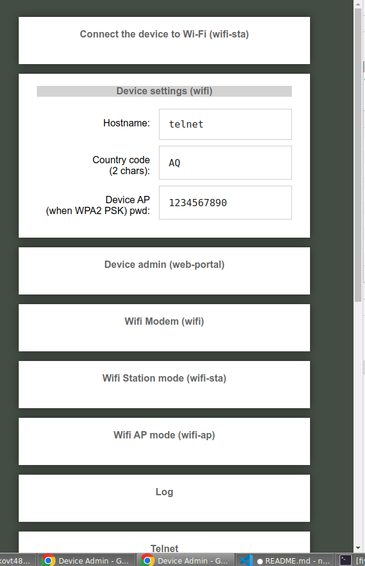
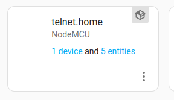
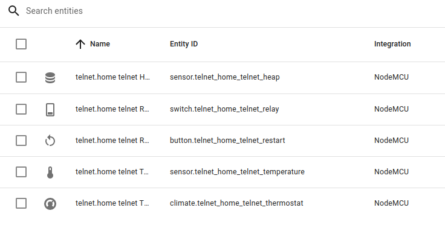

# NodeMCU Device

<!-- @import "[TOC]" {cmd="toc" depthFrom=1 depthTo=6 orderedList=false} -->

<!-- code_chunk_output -->

- [NodeMCU Device](#-nodemcu-device)
  - [What is possible?](#-what-is-possible)
  - [How to use it this repo?](#-how-to-use-it-this-repo)
  - [Image building instructions](#-image-building-instructions)
    - [Additional details](#-additional-details)

<!-- /code_chunk_output -->

This is a repository of [NodeMCU](https://en.wikipedia.org/wiki/NodeMCU) **Lua** modules.

These modules can be built into [SPIFFS](https://nodemcu.readthedocs.io/en/release/spiffs/) and [LFS](https://nodemcu.readthedocs.io/en/release/lfs/) images.

There are unit and even integration tests but coverage is on the lower ends.

## What is possible?

Using WeMos D1 Mini, one can run following and still have about 30kB free RAM:

- Wifi manager
- Http server with Captive portal, OTA and Home Assistant integration
- Telnet
- Thermostat control loop

Example booting sequence is listed [docs/boot-log.txt](docs/boot-log.txt).

Captive portal web page looks like this 

Integration with Home Assistant looks like this  

## How to use it this repo?

Build an image and flash the device. Image content (list of needed C and Lua modules) is defined in `build.config` file. See [building instructions](#image-building-instructions).

hack `lua_modules` to add/remove/modify whatever functionality is needed and build new images.

## Image building instructions

Prerequisites:

internally the build is using [nodemcu-firmware](https://github.com/nodemcu/nodemcu-firmware) to create actual images (firmware, SPFFS and LFS).
Make sure your env can compile it [locally](https://nodemcu.readthedocs.io/en/latest/build/#linux-build-environment)!

Build steps:

- Clone _this_ repo.
- Modify `build.config` (if you find a need).
  - `modules` and `lua-modules` list modules which will be packaged in the images.
    - Make sure you account for all module dependencies, there is no automatic tracking!
  - Other settings are not recommended to change, do so on your own discretion.
- `make config` to generate the build config input.
  - The file is stored under `vendor` folder.
- `make prepare-firmware` to patch firmware headers with needed into:
  - And to prepare `nodemcu-firmware/local` folder content.
- `make build` to build the images.
  - In `vendor/nodemcu-firmware/bin` folder:
    - `0x*.bin` are NodeMCU firmware images.
    - `0x*.img` is the SPIFFS image, packaging also `LFS.img`.
  - In `vendor/nodemcu-firmware/local/fs` are located all files included in SPIFFS image.
    - Any of the files, including actual `LFS.img`, can also be uploaded to the device manually.
- Flash the images to NodeMCU device.
  - `make flash` would flash firmware and SPIFFS (including prepackaged LFS) to ttyUSB device.
- On **first boot**, the device will auto-flash `LFS.img`, packaged inside SPIFFS and reboot again.
  - This is facilitated by `bootprotect`, `init` and `lfs-init` modules.
- After that, on second boot, the device will run its normal boot init sequence.

### Additional details

Internally build would:

- use `vendor` folder as working location for data cloning and output generation
- clone [nodemcu-firmware](https://github.com/nodemcu/nodemcu-firmware):_dev_ branch under `vendor/nodemcu-firmware`.
  - it is used to generate all images
  - one can pre-clone different source tree there manually!
  - _Beware_ that build process modifies files in this source tree (`user_modules.h`, `user_config.h`)!
- clone [nodemcu-custom-build](https://github.com/fikin/nodemcu-custom-build) under `vendor/nodemcu-custom-build`
  - it is used to modify the firmware files prior to image building
  - one can pre-clone different source tree if there is a need.
- clone [nodemcu-lua-mocks](https://github.com/fikin/nodemcu-lua-mocks) to run tests
